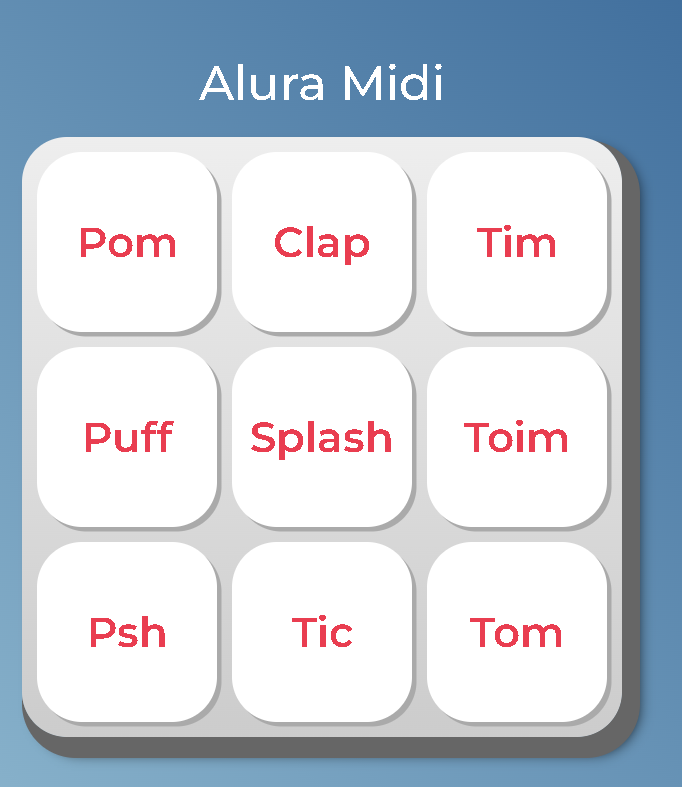

<h1 align="center"> AluraMidi </h1>

Programa promovido pela Alura para ensino de tecnologias.  

  

## 🚀 Tecnologias

Esse projeto foi desenvolvido com as seguintes tecnologias:

- HTML e CSS
- JavaScript

## 💻 Projeto

O AluraMidi é um Instrumento para tocar sons.
